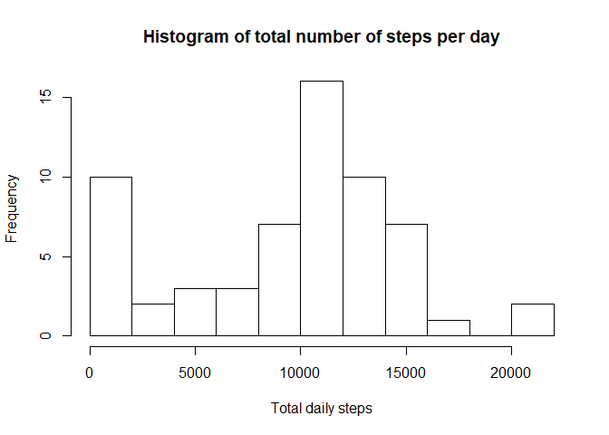
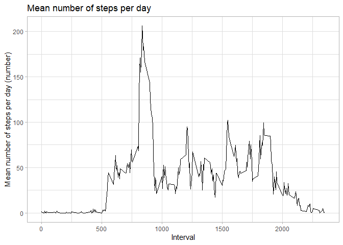
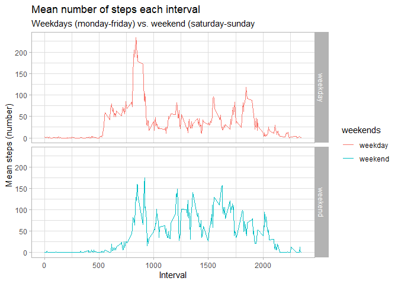

## Loading and preprocessing the data

```r
rm(list = ls())

# ------ Unzip source file -----
zipF<- "C:\\R projects\\RepData_PeerAssessment1\\activity.zip"
outDir<-"C:\\R projects\\RepData_PeerAssessment1"
unzip(zipF,exdir=outDir)

# ------ Load packages -----
library('dplyr')
```

```
## 
## Attaching package: 'dplyr'
```

```
## The following objects are masked from 'package:stats':
## 
##     filter, lag
```

```
## The following objects are masked from 'package:base':
## 
##     intersect, setdiff, setequal, union
```

```r
library('ggplot2')

# ----- Load data -----
# 1. Code for reading in the dataset and/or processing the data
activity <- read.csv("activity.csv", header = T, stringsAsFactors = F)
```

## What is mean total number of steps taken per day?


# ----- Number of steps -----

```r
# 2. Histogram of the total number of steps taken each day
steps_day <- activity %>% 
      group_by(date) %>% 
      summarize(steps_tot_day  = sum(steps, na.rm = T)) # Ignoring missing values

hist(steps_day$steps_tot_day, xlab = "Total daily steps",
     main = "Histogram of total number of steps per day", breaks = 10)
```

<!-- -->

```r
# 3. Mean and median number of steps taken each day
mean(steps_day$steps_tot_day, na.rm = T)
```

```
## [1] 9354.23
```

```r
median(steps_day$steps_tot_day, na.rm = T)
```

```
## [1] 10395
```

## What is the average daily activity pattern?

```r
# 4. Time series plot of the average number of steps taken
steps_day_mean <- activity %>% 
      group_by(interval) %>% 
      summarize(steps_mean_day  = mean(steps, na.rm = T))

ggplot(steps_day_mean, aes(x = interval, y = steps_mean_day, na.rm = T)) +
      geom_line() +
      labs(title = "Mean number of steps per day", 
           x = "Interval", y = "Mean number of steps per day (number)") +  
      theme_light()
```

<!-- -->

```r
# 5. The 5-minute interval that, on average, contains the maximum number of steps
steps_day_mean[which(steps_day_mean$steps_mean_day == max(steps_day_mean$steps_mean_day)),]
```

```
## # A tibble: 1 x 2
##   interval steps_mean_day
##      <int>          <dbl>
## 1      835           206.
```


## Imputing missing values

```r
# 6. Code to describe and show a strategy for imputing missing data
# Calculate and report total number of missing values
sum(is.na(activity))
```

```
## [1] 2304
```

```r
# Filling missing values
activity_replace <- activity %>% 
      mutate_all(~ifelse(is.na(.x), mean(.x, na.rm = TRUE), .x))  

# Check if there are zero missing values
sum(is.na(activity_replace))
```

```
## [1] 0
```

```r
# 7. Histogram of the total number of steps taken each day after missing values are imputed
steps_day_replaced <- activity_replace %>% 
      group_by(date) %>% 
      summarize(steps_tot_day  = sum(steps))

hist(steps_day$steps_tot_day, xlab = "Total daily steps",
     main = "Histogram of total number of steps per day", breaks = 10)
```

<!-- -->

```r
# 7.1 Calculate and report the mean and median total number of steps taken per day
mean(steps_day_replaced$steps_tot_day)
```

```
## [1] 10766.19
```

```r
median(steps_day_replaced$steps_tot_day)
```

```
## [1] 10766.19
```


## Are there differences in activity patterns between weekdays and weekends?

```r
# 8. Panel plot comparing the average number of steps taken per 5-minute interval across weekdays and weekends
activity$date <- as.Date(activity$date)

activity_days <- activity %>% 
      mutate(day = weekdays(activity$date)) %>% 
      mutate(weekends = ifelse(day %in% c("zaterdag", "zondag"), "weekend", "weekday")) %>% 
      group_by(interval, weekends) %>% 
      mutate(steps_tot_day  = mean(steps, na.rm = T))

ggplot(activity_days) +
      geom_line() +
      facet_grid(weekends ~.) +
      aes(x = interval, y = steps_tot_day, color = weekends) + 
      labs(title = "Mean number of steps each interval", 
           subtitle = "Weekdays (monday-friday) vs. weekend (saturday-sunday", 
           y = "Mean steps (number)", x = "Interval") +  
      theme_light()
```

<!-- -->
